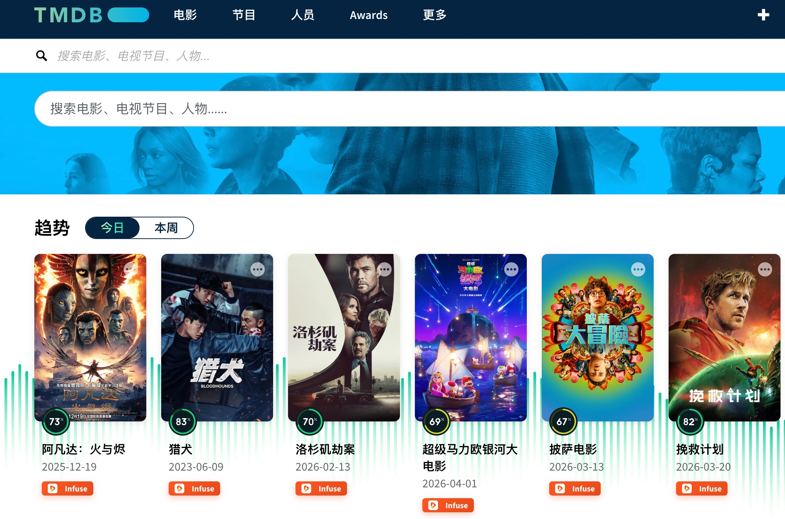

# 使用方法：TMDB2Infuse 浏览器扩展

**TMDB2Infuse** 是一款专为电影迷和 Infuse 用户设计的浏览器扩展。它能够无缝地在 **The Movie Database (TMDB)** 的各个页面中注入 Infuse 深层链接（Deep Links），让你一键从网页跳转到本地或远程的 Infuse 媒体库。

---

## 📸 界面预览 (Screenshots)

### 首页 (Home)

### 搜索结果 (Search)

### 列表页 (Grid)

---

## 🚀 Chrome 安装步骤

1.  **下载源码**：确保本项目的文件夹（`TMDB2Infuse`）已保存在你的电脑上。
2.  **打开扩展管理**：在 Chrome 浏览器地址栏输入 `chrome://extensions/` 并回车。
3.  **开启开发者模式**：点击页面右上角的 **“开发者模式”** 开关。
4.  **加载扩展**：点击左上角的 **“加载已解压的扩展程序”**。
5.  **选择目录**：在弹出的窗口中选择本项目下的 **`extension`** 文件夹。
6.  **完成**：看到 **TMDB2Infuse** 图标出现在列表中即表示安装成功！

---

## 🐒 纂改猴 (Userscript) 安装

### 方式一：一键安装（推荐）
1.  确保你的浏览器已安装 [Tampermonkey](https://www.tampermonkey.net/) 插件。
2.  点击下方按钮（徽章）：

    

3.  在弹出的页面点击“安装”或“更新”。

### 方式二：手动安装
1.  打开 Tampermonkey 控制面板，选择“添加新脚本”。
2.  将本仓库中的 `userscript/TMDB2Infuse.user.js` 内容复制并粘贴。
3.  保存即可生效。

---

## 📖 使用说明

1.  访问 [themoviedb.org](https://www.themoviedb.org/)。
2.  在电影、剧集、季度或剧集页面，以及搜索结果中，寻找橙色的 **“Infuse”** 按钮。
3.  点击该按钮，即可直接在本地或对应的 Infuse 客户端中打开该内容。

---

## 🛠️ 功能说明

### 1. 自动注入 Infuse 按钮
扩展会自动在 TMDB 的几乎所有关键位置添加醒目的橙色 **“Infuse”** 按钮：

-   **详情页顶部**：在电影/剧集的标题操作栏添加主要跳转按钮。
-   **搜索结果页**：在每一个搜索条目的名称/日期下方精准注入。
-   **首页与列表页**：在“热门”、“正在上映”、“即将上映”等所有海报卡片下方添加按钮。
-   **季度与剧集**：在“所有季度”列表和“剧集列表”详情中，每个条目后都会有跳转链接。
-   **播放平台区**：在“Where to Watch”区域添加 Infuse 选项。

### 2. 右键菜单支持
在 TMDB 的网页上，你可以通过右键点击来快速操作：
-   **点击链接/海报**：右键点击任何指向电影或剧集的链接/海报，选择 **“在 Infuse 中打开”**。
-   **在当前页面**：在电影/剧集的详情页空白处点击右键，也可以看到该选项。

---

## 🔗 深层链接逻辑

扩展会智能解析 TMDB 的 ID，并转换为以下 Infuse 协议：
-   **电影**：`infuse://movie/{tmdb_id}`
-   **剧集**：`infuse://series/{tmdb_id}`
-   **季度**：`infuse://series/{tmdb_id}-{season_number}`
-   **剧集**：`infuse://series/{tmdb_id}-{season_number}-{episode_number}`

---

## ✨ 设计特色
-   **尊享设计**：采用与 Infuse 品牌一致的橙色渐变风格，完美融入 TMDB 界面。
-   **自适应布局**：采用左对齐与垂直堆叠逻辑，无论标题长短，按钮始终稳固且美观。
-   **无缝同步**：支持 TMDB 动态加载的内容（如滚动加载和标签切换）。

---

> [!IMPORTANT]
> **前提条件**：您的 Mac 上必须已安装 [**Infuse**](https://apps.apple.com/us/app/infuse/id1136220934) 客户端，深层链接才能生效。

---

## 📂 文件结构
- `extension/`: Chrome 浏览器扩展目录。
    - `manifest.json`: 扩展配置文件。
    - `content.js`: 页面 UI 注入与逻辑核心。
    - `background.js`: 右键菜单与后台处理。
    - `styles.css`: 精美的按钮样式定义。
    - `icons/`: 高清品牌图标。
- `userscript/`: 纂改猴脚本目录。
    - `TMDB2Infuse.user.js`: 单文件版全功能脚本。
